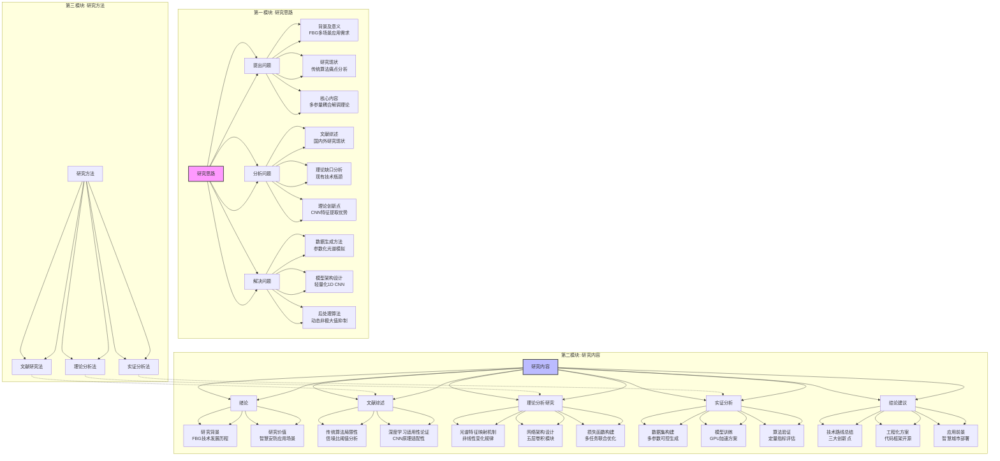

```mermaid
graph TD
    %% 第一列：总览节点
    A[研究思路] --> B[提出问题]
    A --> C[分析问题]
    A --> D[解决问题]

    E[研究内容] --> F[绪论]
    E --> G[文献综述]
    E --> H[理论分析研究]
    E --> I[实证分析]
    E --> J[结论建议]

    K[研究方法] --> L[文献研究法]
    K --> M[理论分析法]
    K --> N[实证分析法]

    %% 第二列：子节点连接
    B --> B1["背景及意义\nFBG多场景应用需求"]
    B --> B2["研究现状\n传统算法痛点分析"]
    B --> B3["核心内容\n多参量耦合解调理论"]

    C --> C1["文献综述\n国内外研究现状"]
    C --> C2["理论缺口分析\n现有技术瓶颈"]
    C --> C3["理论创新点\nCNN特征提取优势"]

    D --> D1["数据生成方法\n参数化光谱模拟"]
    D --> D2["模型架构设计\n轻量化1D CNN"]
    D --> D3["后处理算法\n动态非极大值抑制"]

    F --> F1["研究背景\nFBG技术发展历程"]
    F --> F2["研究价值\n智慧安防应用场景"]

    G --> G1["传统算法局限性\n信噪比阈值分析"]
    G --> G2["深度学习适用性论证\nCNN原理适配性"]

    H --> H1["光谱特征映射机制\n非线性变化规律"]
    H --> H2["网络架构设计\n五层卷积模块"]
    H --> H3["损失函数构建\n多任务联合优化"]

    I --> I1["数据集构建\n多参数可控生成"]
    I --> I2["模型训练\nGPU加速方案"]
    I --> I3["算法验证\n定量指标评估"]

    J --> J1["技术路线总结\n三大创新点"]
    J --> J2["工程化方案\n代码框架开源"]
    J --> J3["应用前景\n智慧城市部署"]

    %% 方法引用虚线
    L -.-> G
    M -.-> H
    N -.-> I

    %% 布局优化：用subgraph形成矩形结构
    subgraph 第一模块: 研究思路
        A --> B
        A --> C
        A --> D
        B --> B1
        B --> B2
        B --> B3
        C --> C1
        C --> C2
        C --> C3
        D --> D1
        D --> D2
        D --> D3
    end

    subgraph 第二模块: 研究内容
        E --> F
        E --> G
        E --> H
        E --> I
        E --> J
        F --> F1
        F --> F2
        G --> G1
        G --> G2
        H --> H1
        H --> H2
        H --> H3
        I --> I1
        I --> I2
        I --> I3
        J --> J1
        J --> J2
        J --> J3
    end

    subgraph 第三模块: 研究方法
        K --> L
        K --> M
        K --> N
    end

    %% 节点样式
    style A fill:#f9f,stroke:#333,stroke-width:2px
    style E fill:#bbf,stroke:#333,stroke-width:2px

```