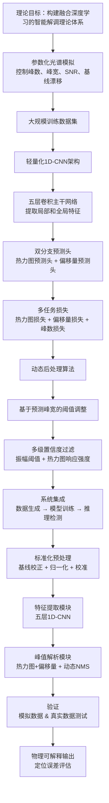

```mermaid
flowchart TB
  %% 理论目标
  A[理论目标：构建融合深度学习的智能解调理论体系]

  %% 数据生成模块
  B1[参数化光谱模拟<br/>控制峰数、峰宽、SNR、基线漂移]
  B1 --> B2[大规模训练数据集]

  %% 模型设计模块
  C1[轻量化1D-CNN架构]
  C2[五层卷积主干网络<br/>提取局部和全局特征]
  C3[双分支预测头<br/>热力图预测头 + 偏移量预测头]
  C4[多任务损失<br/>热力图损失 + 偏移量损失 + 峰数损失]
  C1 --> C2
  C2 --> C3
  C3 --> C4

  %% 后处理模块
  D1[动态后处理算法]
  D2[基于预测峰宽的阈值调整]
  D3[多级置信度过滤<br/>振幅阈值 + 热力图响应强度]
  D1 --> D2
  D2 --> D3

  %% 系统实现
  E1[系统集成<br/>数据生成 → 模型训练 → 推理检测]
  E2[标准化预处理<br/>基线校正 + 归一化 + 校准]
  E3[特征提取模块<br/>五层1D-CNN]
  E4[峰值解析模块<br/>热力图+偏移量 + 动态NMS]
  E5[验证<br/>模拟数据 & 真实数据测试]
  E6[物理可解释输出<br/>定位误差评估]
  E1 --> E2
  E2 --> E3
  E3 --> E4
  E4 --> E5
  E5 --> E6

  %% 整体流程
  A --> B1
  B2 --> C1
  C4 --> D1
  D3 --> E1

```