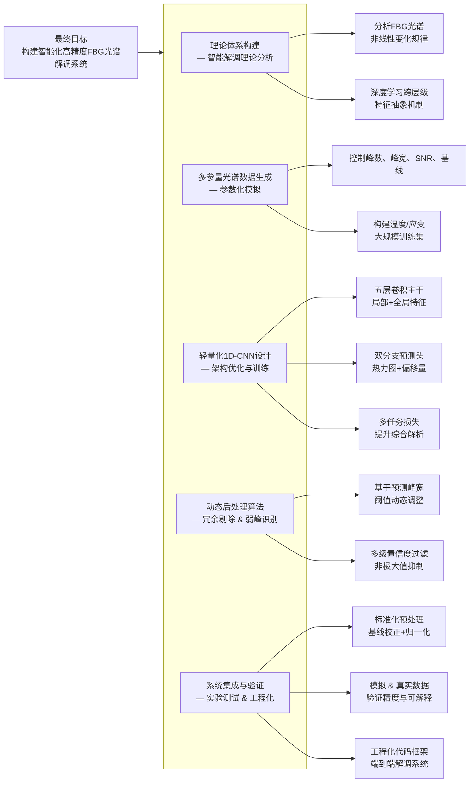

```mermaid
flowchart LR
    %% 总目标
    A[最终目标<br/>构建智能化高精度FBG光谱解调系统]
    
    %% 关键模块
    subgraph Modules [ ]
        direction TB
        B1[理论体系构建<br/>— 智能解调理论分析]
        B2[多参量光谱数据生成<br/>— 参数化模拟]
        B3[轻量化1D-CNN设计<br/>— 架构优化与训练]
        B4[动态后处理算法<br/>— 冗余剔除 & 弱峰识别]
        B5[系统集成与验证<br/>— 实验测试 & 工程化]
    end

    %% 连接
    A --> Modules

    %% 子任务分解
    B1 --> C11[分析FBG光谱<br/>非线性变化规律]
    B1 --> C12[深度学习跨层级<br/>特征抽象机制]
    
    B2 --> C21[控制峰数、峰宽、SNR、基线]
    B2 --> C22[构建温度/应变<br/>大规模训练集]

    B3 --> C31[五层卷积主干<br/>局部+全局特征]
    B3 --> C32[双分支预测头<br/>热力图+偏移量]
    B3 --> C33[多任务损失<br/>提升综合解析]

    B4 --> C41[基于预测峰宽<br/>阈值动态调整]
    B4 --> C42[多级置信度过滤<br/>非极大值抑制]

    B5 --> C51[标准化预处理<br/>基线校正+归一化]
    B5 --> C52[模拟 & 真实数据<br/>验证精度与可解释]
    B5 --> C53[工程化代码框架<br/>端到端解调系统]

```