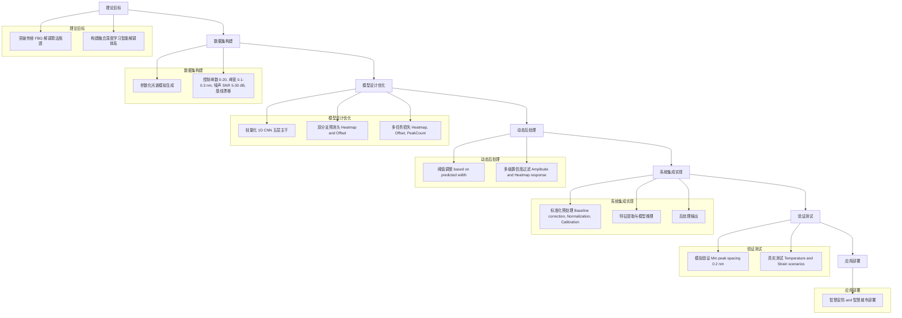

```mermaid
flowchart TD
    A[理论目标] --> B[数据集构建]
    B --> C[模型设计优化]
    C --> D[动态后处理]
    D --> E[系统集成实现]
    E --> F[验证测试]
    F --> G[应用部署]

    subgraph 理论目标
        A1[突破传统 FBG 解调算法瓶颈]
        A2[构建融合深度学习智能解调体系]
    end
    A --> A1
    A --> A2

    subgraph 数据集构建
        B1[参数化光谱模拟生成]
        B2[控制峰数 0-20, 峰宽 0.1-0.3 nm, 噪声 SNR 5-30 dB, 基线漂移]
    end
    B --> B1
    B --> B2

    subgraph 模型设计优化
        C1[轻量化 1D CNN 五层主干]
        C2[双分支预测头 Heatmap and Offset]
        C3[多任务损失 Heatmap, Offset, PeakCount]
    end
    C --> C1
    C --> C2
    C --> C3

    subgraph 动态后处理
        D1[阈值调整 based on predicted width]
        D2[多级置信度过滤 Amplitude and Heatmap response]
    end
    D --> D1
    D --> D2

    subgraph 系统集成实现
        E1[标准化预处理 Baseline correction, Normalization, Calibration]
        E2[特征提取与模型推理]
        E3[后处理输出]
    end
    E --> E1
    E --> E2
    E --> E3

    subgraph 验证测试
        F1[模拟验证 Min peak spacing 0.2 nm]
        F2[真实测试 Temperature and Strain scenarios]
    end
    F --> F1
    F --> F2

    subgraph 应用部署
        G1[智慧安防 and 智慧城市部署]
    end
    G --> G1

```