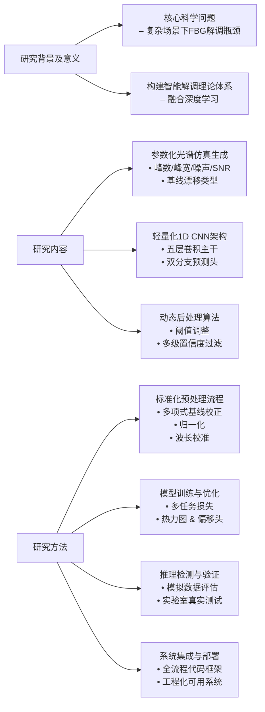

```mermaid
flowchart LR
    %% 左侧：三个核心模块
    M1["研究背景及意义"]
    M2["研究内容"]
    M3["研究方法"]

    %% 右侧：模块一子任务
    A1["核心科学问题\n– 复杂场景下FBG解调瓶颈"]
    A2["构建智能解调理论体系\n– 融合深度学习"]

    %% 右侧：模块二子任务
    B1["参数化光谱仿真生成\n• 峰数/峰宽/噪声/SNR\n• 基线漂移类型"]
    B2["轻量化1D CNN架构\n• 五层卷积主干\n• 双分支预测头"]
    B3["动态后处理算法\n• 阈值调整\n• 多级置信度过滤"]

    %% 右侧：模块三子任务
    C1["标准化预处理流程\n• 多项式基线校正\n• 归一化\n• 波长校准"]
    C2["模型训练与优化\n• 多任务损失\n• 热力图 & 偏移头"]
    C3["推理检测与验证\n• 模拟数据评估\n• 实验室真实测试"]
    C4["系统集成与部署\n• 全流程代码框架\n• 工程化可用系统"]

    %% 连线：模块 → 子任务
    M1 --> A1
    M1 --> A2

    M2 --> B1
    M2 --> B2
    M2 --> B3

    M3 --> C1
    M3 --> C2
    M3 --> C3
    M3 --> C4

```