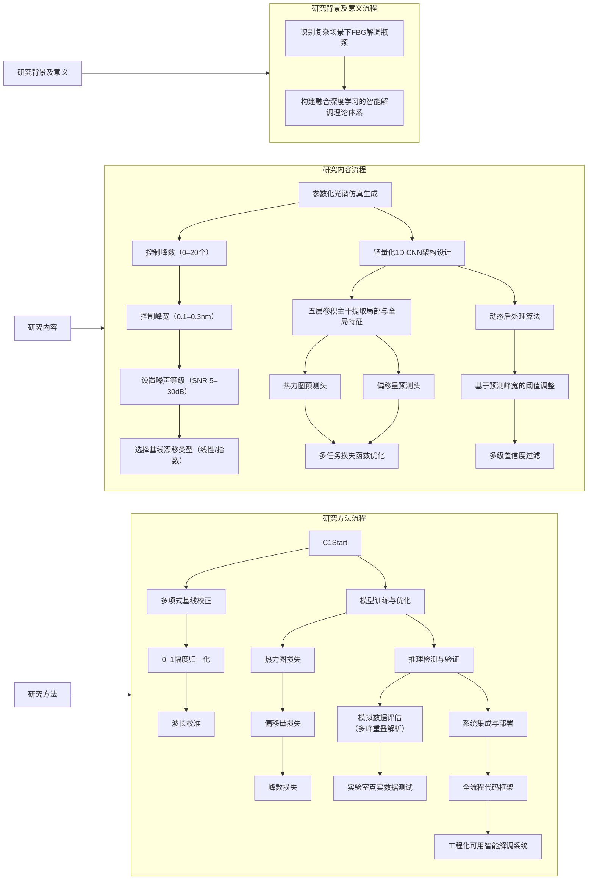

```mermaid
flowchart LR
    %% 左侧：模块名称
    M1["研究背景及意义"]
    M2["研究内容"]
    M3["研究方法"]

    %% 模块一的流程图
    subgraph M1G["研究背景及意义流程"]
        direction TB
        A1["识别复杂场景下FBG解调瓶颈"]
        A2["构建融合深度学习的智能解调理论体系"]
        A1 --> A2
    end

    %% 模块二的流程图
    subgraph M2G["研究内容流程"]
        direction TB
        B1Start["参数化光谱仿真生成"]
        B1a["控制峰数（0–20个）"]
        B1b["控制峰宽（0.1–0.3nm）"]
        B1c["设置噪声等级（SNR 5–30dB）"]
        B1d["选择基线漂移类型（线性/指数）"]
        B1Start --> B1a --> B1b --> B1c --> B1d

        B2Start["轻量化1D CNN架构设计"]
        B2a["五层卷积主干提取局部与全局特征"]
        B2b["热力图预测头"]
        B2c["偏移量预测头"]
        B2d["多任务损失函数优化"]
        B2Start --> B2a --> B2b
        B2a --> B2c
        B2b --> B2d
        B2c --> B2d

        B3Start["动态后处理算法"]
        B3a["基于预测峰宽的阈值调整"]
        B3b["多级置信度过滤"]
        B3Start --> B3a --> B3b

        %% 按顺序展开
        B1Start --> B2Start --> B3Start
    end

    %% 模块三的流程图
    subgraph M3G["研究方法流程"]
        direction TB
        %%C1Start["标准化预处理"]
        C1a["多项式基线校正"]
        C1b["0–1幅度归一化"]
        C1c["波长校准"]
        C1Start --> C1a --> C1b --> C1c

        C2Start["模型训练与优化"]
        C2a["热力图损失"]
        C2b["偏移量损失"]
        C2c["峰数损失"]
        C2Start --> C2a --> C2b --> C2c

        C3Start["推理检测与验证"]
        C3a["模拟数据评估\n（多峰重叠解析）"]
        C3b["实验室真实数据测试"]
        C3Start --> C3a --> C3b

        C4Start["系统集成与部署"]
        C4a["全流程代码框架"]
        C4b["工程化可用智能解调系统"]
        C4Start --> C4a --> C4b

        %% 串联整体流程
        C1Start --> C2Start --> C3Start --> C4Start
    end

    %% 模块 → 子图
    M1 --> M1G
    M2 --> M2G
    M3 --> M3G

```