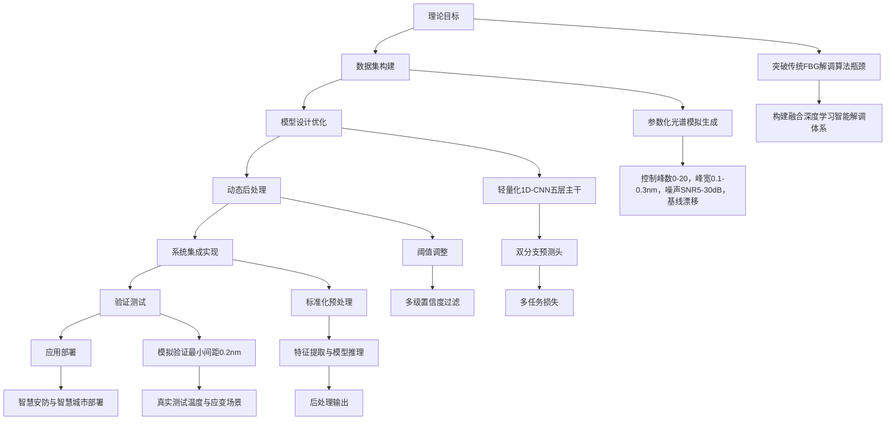

```mermaid
flowchart TD
    %% 主干竖线：阶段标题
    T1[理论目标] --> T2[数据集构建] --> T3[模型设计优化] --> T4[动态后处理] --> T5[系统集成实现] --> T6[验证测试] --> T7[应用部署]

    %% 各阶段子流程（横向展开）
    T1 --> A1[突破传统FBG解调算法瓶颈] --> A2[构建融合深度学习智能解调体系]
    T2 --> B1[参数化光谱模拟生成] --> B2[控制峰数0-20，峰宽0.1-0.3nm，噪声SNR5-30dB，基线漂移]
    T3 --> C1[轻量化1D-CNN五层主干] --> C2[双分支预测头] --> C3[多任务损失]
    T4 --> D1[阈值调整] --> D2[多级置信度过滤]
    T5 --> E1[标准化预处理] --> E2[特征提取与模型推理] --> E3[后处理输出]
    T6 --> F1[模拟验证最小间距0.2nm] --> F2[真实测试温度与应变场景]
    T7 --> G1[智慧安防与智慧城市部署]

```