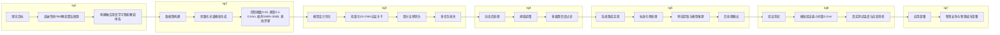

```mermaid
flowchart LR
    %% 第一阶段：理论目标
    subgraph sg1
        T1[理论目标] --> T2[突破传统FBG解调算法瓶颈] --> T3[构建融合深度学习智能解调体系]
    end

    %% 第二阶段：数据集构建
    subgraph sg2
        D1[数据集构建] --> D2[参数化光谱模拟生成] --> D3[控制峰数0-20, 峰宽0.1-0.3nm, 噪声SNR5-30dB, 基线漂移]
    end

    %% 第三阶段：模型设计优化
    subgraph sg3
        M1[模型设计优化] --> M2[轻量化1D-CNN五层主干] --> M3[双分支预测头] --> M4[多任务损失]
    end

    %% 第四阶段：动态后处理
    subgraph sg4
        P1[动态后处理] --> P2[阈值调整] --> P3[多级置信度过滤]
    end

    %% 第五阶段：系统集成实现
    subgraph sg5
        S1[系统集成实现] --> S2[标准化预处理] --> S3[特征提取与模型推理] --> S4[后处理输出]
    end

    %% 第六阶段：验证测试
    subgraph sg6
        V1[验证测试] --> V2[模拟验证最小间距0.2nm] --> V3[真实测试温度与应变场景]
    end

    %% 第七阶段：应用部署
    subgraph sg7
        U1[应用部署] --> U2[智慧安防与智慧城市部署]
    end

    %% 阶段间连接
    T3 --> D1
    D3 --> M1
    M4 --> P1
    P3 --> S1
    S4 --> V1
    V3 --> U1

```